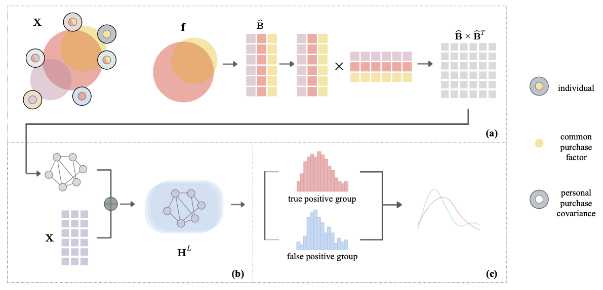

# Predicting Housing Transaction with Common Covariance GNNs
 This repository contains the experimental codes for the  IJCAI 2024 paper "Predicting Housing Transaction with Common Covariance GNNs".

Urban migration is a significant aspect of a city's economy. The exploration of the underlying determinants of housing purchases among current residents contributes to the study of future trends in urban migration, enabling governments to formulate appropriate policies to guide future economic growth.

This article employs a factor model to analyze data on residents' rental, first-time home purchases, and subsequent housing upgrades. We decompose the factors influencing housing purchases into common drivers and specific drivers. Our hypothesis is that common drivers reflect universal social patterns, while personalized drivers represent stochastic elements. We construct a correlation matrix capturing the inter-resident relationships based on the common drivers of housing purchases. We then propose a graph neural network based on the correlation matrix to model housing predictions as a node classification problem. 



## Overview
We perform two extensive experiments on real-world datasets to predict housing predictions:

1. First house purchases
2. Subsequent house purchases

For each experiment, we train Common Covariance GNNs (ccGNNs) using [*DGL*](https://docs.dgl.ai/) Library. Next, we utilize the results obtained from the best models to conduct the hypothesis testing on predicted buyers.

Overview of important files/directories:

- ```\zu_mai```: Python scripts and notebooks for *first house purchases* experiment.
- ```\mai_huan```: Python scripts and notebooks for *Subsequent house purchases* experiment.
- ```model.py```: Python scripts for well-known graph neural networks including Graph Convolutional Network (GCN), Graph Attention Network (GAT), ChebyNet, GraphSage, Topology Adaptive Graph Convolutional Networks (TAGCN).

## Requirements
- python 3.9.7
- torch 1.17.0
- dgl 1.1.1
- factor_analyzer
- numpy
- pandas
- scipy
- scikit-learn

## Usage
1. Construct resident-resident correlated graphs using their shared covariance in housing purchases (```zu_mai/adj.py``` or ```mai_huan/adj.py```)
2. Run our ccGNNs method (```zu_mai/main.py``` or ```mai_huan/main.py```)


